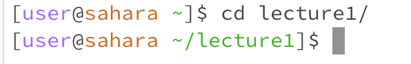
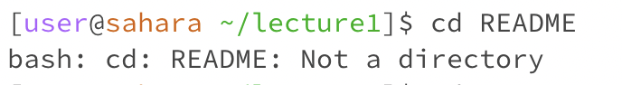
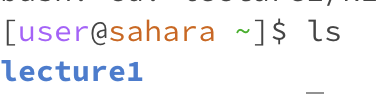

# CSE 15L Lab Report 1

In this lab, I will be writing about the commands *cd, ls,* and *cat*.

## cd

For this command, when it is used with nothing, nothing appears. This is not an error, because *cd* stands for change directory, and we are telling it to change directory to the main directory, which it is already in. This can be seen in the image below, where the command is typed and it still shows the user in the main directory. If we were to do the same thing already in a directory, it would send the user back to the main directory.

When a argument added which is a directory, the cd command takes the user to the specified directory, granted it exists. This isn't an error. This can be seen in the image below where the user goes from the main directory to the *lecture1* directory. 

When used with an argument that is a file, it sends out a message saying that the file is not a directory. This can count as an error, because it's telling us we can't use the cd command with the given argument. In the image below, this is shown, with the user already in the lecture directory to access the *README* file.

##ls

For the *ls* command, it sends out the available directories to go to when it is used with no other arguments. This isn't an error. This can be seen in the image below as well, where it shows the only directory available to go to from the main directory directly.

