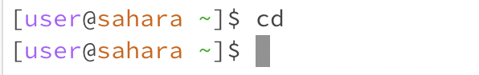

# CSE 15L Lab Report 1

In this lab, I will be writing about the commands *cd, ls,* and *cat*.

## cd

For this command, when it is used with nothing, nothing appears. This is not an error, because *cd* stands for change directory, and we are telling it to change directory to the main directory, which it is already in. This can be seen in the image below, where the command is typed and it still shows the user in the main directory. If we were to do the same thing already in a directory, it would send the user back to the main directory.

When a argument added which is a directory, the cd command takes the user to the specified directory, granted it exists. This isn't an error. This can be seen in the image below where the user goes from the main directory to the *lecture1* directory. 

When used with an argument that is a file, it sends out a message saying that the file is not a directory. This can count as an error, because it's telling us we can't use the cd command with the given argument. In the image below, this is shown, with the user already in the lecture directory to access the *README* file.

##ls

For the *ls* command, it sends out the available directories to go to when it is used with no other arguments. This isn't an error. This can be seen in the image below as well, where it shows the only directory available to go to from the main directory directly.

When it is used with a directory agrument, it shows the files and other directories that can be accessed with the typed directory argument. Again, this isn't an error. Example can be seen below when the user types the *lecture1* directory argument with the *ls* command.

For when *ls* command is used with a file argument, it reads out the name of the file and what is accessable. This isn't an error. This can be seen in the given image below, when the user accesses the *README* file by going through the *lecture1* directory, where it states that only the *README* file can be currently accessed through here.

##cat

When the *cat* command is used without any arguments, it doesn't do anything. This isn't an error. This makes sense as the cat command is used to read out the file given, so when there is no file  given, it prints out nothing from the main directory. This can be seen below, when it is ran straight from the main directory.

When the *cat* command is ran with a given directory argument, again, it prints nothing. As like the previous one above, this isn't an error. This makes sense as the cat command is used to read out the file given, so when there is no file given, it prints out nothing from the *lecture1* directory. The image below represents this, where the *lecture1* argument is added the *cat* command to see the result.

For when *cat* command is used with a file argument, it reads out the contents of what the given file says. This isn't an error. This can be seen in the given image below, when the user accesses the *README* file by going through the *lecture1* directory, where it prints out what the *README* says, which is in summary how to run the given program.

