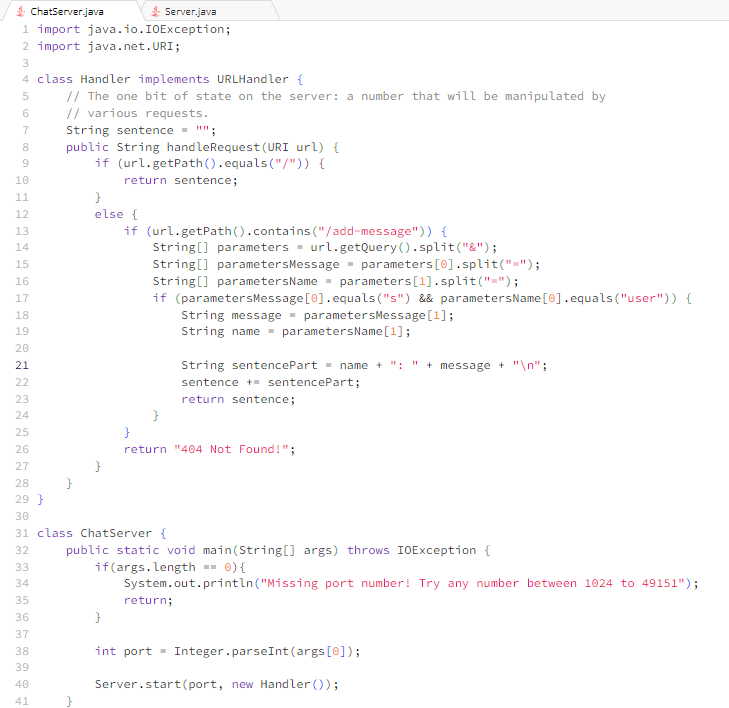
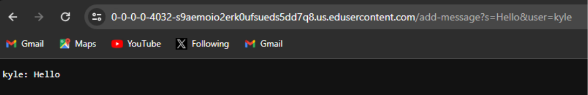
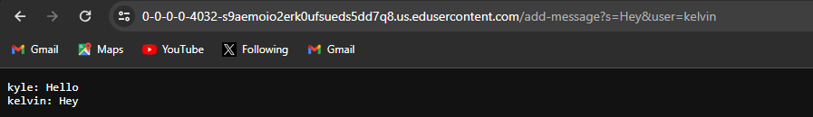
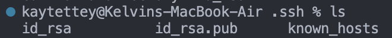
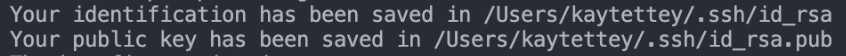
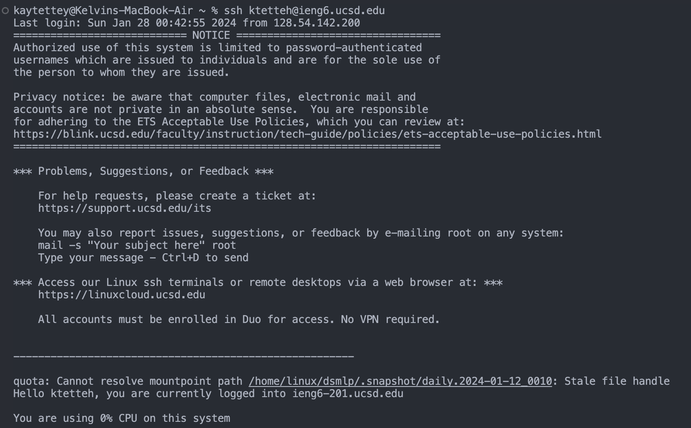

# CSE 15L Lab Report 2

## Part 1 - ChatServer 

Above is the code for ChatServer, which adds on lines of chat one or more people could be having manually by splitting the query into multiple parts

The first added conversation shows the user "kyle" saying "hello". The method called on this addition was the handleRequest(URI url) method. The relevant argument to this method was, of course, the *URI url* argument, which is the url typed into the search bar in the web browser.
What happens in this method is that the url is broken up to just get the query (url.getQuery()), and then split multiple times to make 3 different lists. The *String[] parameters* list stores and splits the message and user arguments into two different parts by splitting at the *&* character. 
  
  The first index argument (index 0) of *String[] parameters* (In this case s=Hello) is stored in another String list (String[]) called *parametersMessage*. The *String[] parametersMessage* list is formed by splitting the message argument by the *=* character, where now the 0 index is "s" and index 1 is 
"Hello", the actual message. 
  
  The second index argument (index 1) of *String[] parameters* (In this case user=kyle) is stored in the third String list (String[]) called *parametersName*. That list is also formed by splitting the user argument by the *=* character, where now the 0 index in *String[] parametersName* is "user"
and index 1 is "kyle", the actual user part. 

Then, when everything is split and in the right order to get their keywords, the handleResquest method checks if they started off the path correctly (checking for "s", the 0 index for *String[] parametersMessage*. Then, it stores the parameters message and user in the variable *message* and *name*, which then
is used to form the correct chatlog format, which is the variable *sentencepart*, which then gets added to another variable *sentence*. Having it set up so that it gets added to another variable allows the chat log to update itself as more and more queries are added.

The second added conversation shows the user "kelvin" saying "Hey". The method called on this addition was again the handleRequest(URI url) method. The relevant argument to this method was again the *URI url* argument, which is the url typed into the search bar in the web browser.
What happens in this method is that the url is broken up to just get the query (url.getQuery()), and then split multiple times to make 3 different lists. Note that the 3 different lists and nearly all the variables except *sentence*. reset their values after a new query/add is given. The *String[] parameters* list stores and splits the message and user arguments into two different parts by splitting at the *&* character. 
  
  The first index argument (index 0) of *String[] parameters* (In this case s=Hey) is stored in another String list (String[]) called *parametersMessage*. The *String[] parametersMessage* list is formed by splitting the message argument by the *=* character, where now the 0 index is "s" and index 1 is 
"Hey", the actual message. 
  
  The second index argument (index 1) of *String[] parameters* (In this case user=kelvin) is stored in the third String list (String[]) called *parametersName*. That list is also formed by splitting the user argument by the *=* character, where now the 0 index in *String[] parametersName* is "user"
and index 1 is "kelvin", the actual user part. 

Then like before, when everything is split and in the right order to get their keywords, the handleResquest method checks if they started off the path correctly (checking for "s", the 0 index for *String[] parametersMessage*. Then, it stores the parameters message and user in the variable *message* and *name*, which then
is used to form the correct chatlog format, which is the variable *sentencepart*, which then gets added to another variable *sentence*. As said before, leaving it set up so that it gets added to another variable (which doesn't get reset with a new addition) allows the chat log to update itself as more and more additions are made.

## Part 2 - SSH Key

Above the direct file locations for the public AND private keys.

Above is the other proof of their locations

Above is the login proof that a password is not prompted anymore

## Part 3 - New Learnings

Over weeks 2 and 3, I have learned a lot of new things. One of the first things I learned was the parts of the URL and what each part meant. Then, one of the most major ones was learning how to set up and run my own server, and how I could edit my own page and make additions/paths to my page, while also saving data to these pages. I also learned how to ssh into a remote server in the school, which was really interesting for me.
