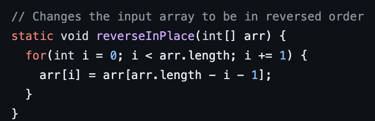
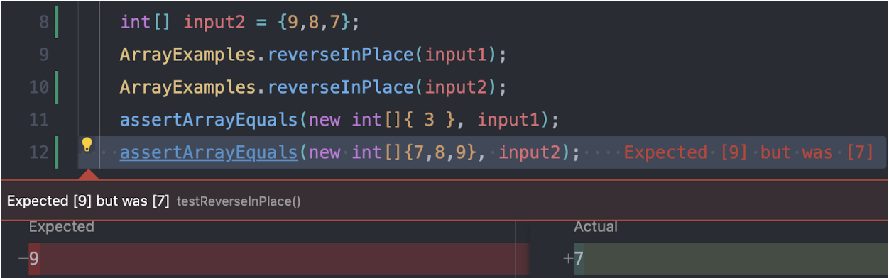

# CSE 15L Lab Report 3

## Part 1 - Bugs

The method I picked out was the bug in ArrayExamples.java, whihc was the *reverseInPlace* method.



A failure inducing output for that method was when I tried to reverse numbers decreasing by one, which was when I tried:

```
int[] input2 = {9,8,7};
assertEquals(new int[] {7,8,9}, input2);
```

An input that doesn't have a failure is when there is on element in the array, such as:

```
int[] input1 = {3};
assertEquals(new int[] {3}, input1);
```

The problem in the method was really just how it accessed and tried to reverse the data, as it seemed to not change the data much at all:



To fix this, I made a temporary array with the same data values, changed the values in there, and then made the original array the same as the temporary array

Before the method looked like this:

```
static void reverseInPlace(int[] arr) {
    for(int i = 0; i < arr.length; i += 1) {
      arr[i] = arr[arr.length - i - 1];
    }
  }
```

Now it looks like this:

```
static void reverseInPlace(int[] arr) {
    int[] temp = new int[arr.length];
    for(int i = 0; i < arr.length; i += 1) {
      temp[i] = arr[i];
    }
    for(int i = 0; i < arr.length; i += 1) {
      arr[i] = temp[temp.length - 1 - i];
    }
  }
```
This fix adresses the issue because the array is now easlily able to get the reversed items into the correct order by copying over from the temp array rather than do it in its own array, which it can't when it is changing the values inide itself already

## Part 2: Researching Commands

The command I chose to research is the *grep* command, which typically takes a string and a file and prints out to the user *all* the lines in that file that match the string. Grep also has some interesting command line arguments to use, such as:

### -r

This command line argument when added to grep looks for the pattern throughout all of the directories (gnu.org).
An example of this can be seen when we try to see the number of lines that have the string "base pair in the technical/plos directory;

```
kaytettey@Kelvins-MacBook-Air docsearch % grep -r "base pair" technical/plos > plos.txt 
kaytettey@Kelvins-MacBook-Air docsearch % wc  plos.txt
       3      48     412 plos.txt
```
With the command, it searches all the files in technical/plos directory for the exact string "base pair". The output shows us that there is only 3 lines with the string "base pair" in the technical/plos directories. This is helpful because with this command, we can find matching files for info we need more quickly.

Another example of this can be seen when the same is tried again, but this time to see in the technical/biomed directory:

```
kaytettey@Kelvins-MacBook-Air docsearch %  grep -r "base pair" technical/biomed > biomed-base-pair.txt
kaytettey@Kelvins-MacBook-Air docsearch % wc biomed-base-pair.txt
     226    2326   22534 biomed-base-pair.txt
```
With the command, it searches all the files in technical/biomed directory for the exact string "base pair". The output shows us that there is 226 lines with the string "base pair" in the technical/biomed directories. Again, this is helpful because with this command, we can find matching files for info we need more quickly.

### -c

This command line argument when added to grep prints out the count of matching lines for each input file. (gnu.org).
An example of this can be seen when we try to see the count of matching lines that have the string "Americans" in the techncical/911report directory in the file *chapter-2.txt*:

```
kaytettey@Kelvins-MacBook-Air 911report % grep -c "Americans" chapter-2.txt
17
```
What happened above was that the command looked through how many lines contained the string "Americans" in the chapter-2.txt file, and it turns out there is 17 lines that contain that string. This is helpful because it allows us to know the instances of a string in a file that would take much longer/less accurate if we tried looking though each file individualy and counted.

Another example of this can be seen when we try to see the count of matching lines that have the string "kill" in the techncical/911report directory in the file *chapter-2.txt*:

```
kaytettey@Kelvins-MacBook-Air 911report % grep -c "kills" chapter-2.txt
5
```
What happened above was that the command looked through how many lines contained the string "kills" in the chapter-2.txt file, and it turns out there is about 5 lines that contain that string. Again, this is helpful because it allows us to know the instances of a string in a file that would take much longer/less accurate if we tried looking though each file individualy and counted, and in addition, we can come to more conlusions on the text based on how frequent each word we look for is.

### -m *num*

This command instead prints the whole line of the first *num* instances where the specified string was called in a file. 
For example, if I wanted to see the first 5 lines that contain the string "Americans" in chapter-2.txt (in the technical/911report directory)

```
kaytettey@Kelvins-MacBook-Air 911report % grep -m 5 "Americans" chapter-2.txt 
            He claimed it was more important for Muslims to kill Americans than to kill other
                in the world today and the worst terrorists are the Americans. Nothing could stop
                shall-with the grace of Allah-prevail over the Americans." He went on to warn that
                Americans-win thousands of followers and some degree of approval from millions more?
                his message are largely unknown to many Americans. Seizing on symbols of Islam's
```
What happened in the code block above was that the command looked for and printed out the first 5 instances of the lines the contained the string "Americans". This can be really helpful as it allows the user to look up speciifc information that can be defined to a specific word and gain more context on what that word was used for in a quick and easy matter.

Another example can be seen below, where I wanted to see the first 3 lines that contain the string "kills" in chapter-2.txt, while in the technical/911report directory:

```
kaytettey@Kelvins-MacBook-Air 911report % grep -m 3 "kills" chapter-2.txt 
                enormous number trained only in religious schools, lacked the skills needed by their
                societies. Far more acquired valuable skills but lived in stagnant economies that
                abroad, lacked the perspective and skills needed to understand a different culture.
```
Again, what happened in the code block was that the command looked for and printed out the first 3 instances of the lines the contained the string "kills". As said before, this can be really helpful as it allows the user to look up speciifc information that can be defined to a specific word and gain more context on what that word was used for in a quick and easy matter.

### -l

For this command, it prints out the files (which are given by the user) which have the contained string given by the user.
For the example below, the user is looking for the string 'kills' in the technical/911report directory in the files *chapter-2.txt*, *chapter-3.txt*, *chapter-13.2.txt*, *chapter-13.3.txt*:

```
kaytettey@Kelvins-MacBook-Air 911report % grep -l "kills" chapter-2.txt chapter-3.txt chapter-13.2.txt chapter-13.3.txt
chapter-2.txt
chapter-3.txt
```
What happened in the code block above was that it looked through the 4 files given for the string "kills", and since *chapter-2.txt* and *chapter-3.txt* contain the string, those were print out in the terminal. This is helpful because this allows users to quickly check for where something they are looking for could be act quickly and in a efficent manner.

For the other example, the user is looking for the string 'Americans' in the technical/911report directory in the same files, which are *chapter-2.txt*, *chapter-3.txt*, *chapter-13.2.txt*, *chapter-13.3.txt*:

```
kaytettey@Kelvins-MacBook-Air 911report % grep -l "Americans" chapter-2.txt chapter-3.txt chapter-13.2.txt chapter-13.3.txt
chapter-2.txt
chapter-3.txt
chapter-13.3.txt
```
What happened in the code block was that it looked through the 4 files given for the string "Americans", and since *chapter-2.txt*, *chapter-3.txt*, and *chapter13.3.txt* contain the string, those were print out in the terminal. Like said before, this is helpful because this allows users to quickly check for where something they are looking for could be act quickly and in a efficent manner.

## Websites Used
[gnu.org](https://www.gnu.org/software/grep/manual/grep.html#File-and-Directory-Selection)
