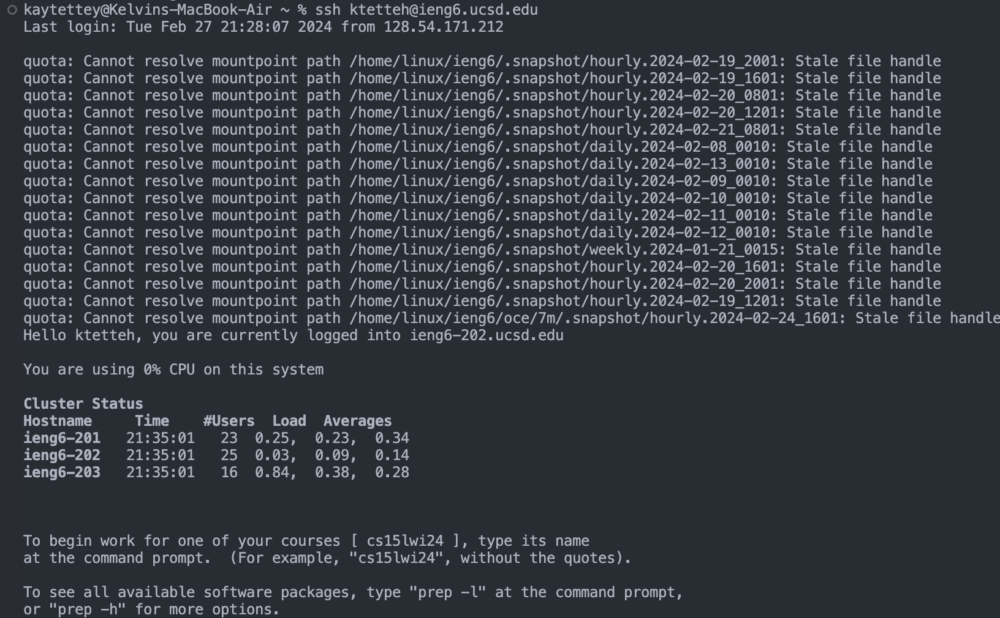
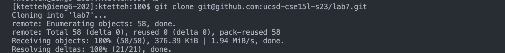
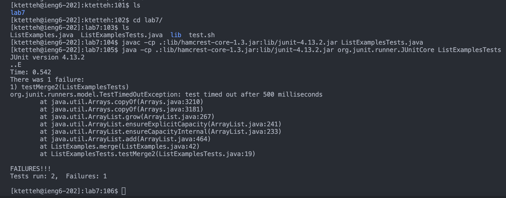
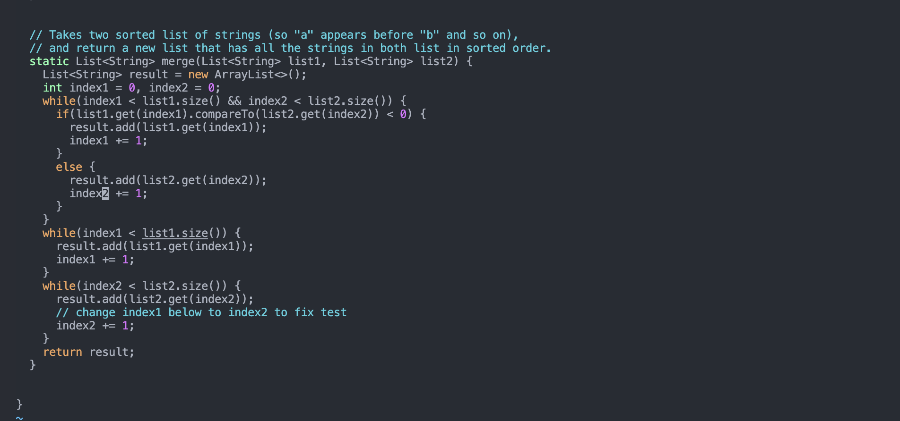
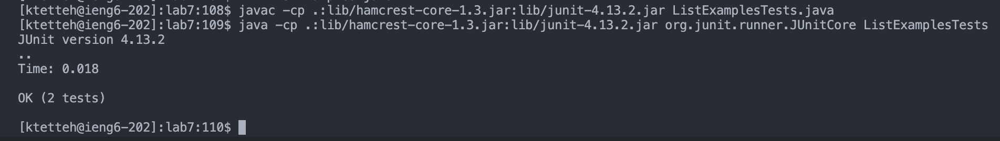
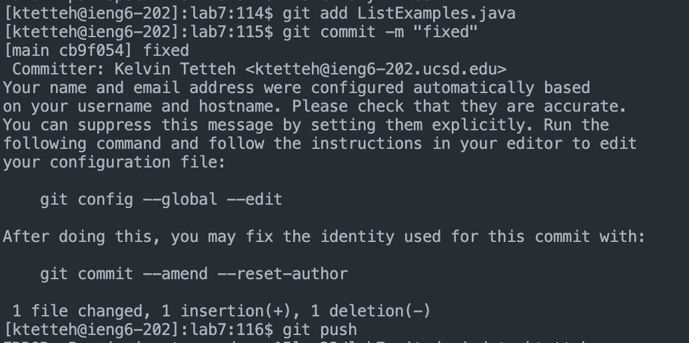

# CSE 15L Lab Report 4

## Step 4 - SSH Login

Keys Pressed: `<up> <enter>`. I had already had the ssh login saved to bash because of me double checking where my public keys were.

## Step 5 - Clone

Keys Pressed: `<up> <up> <up> <enter>`. After previous tests of cloning and running into issues on cloning into non-empty directories that I fixed, the command was 3 up and I was able to access it still rather than typing out the full command.

## Step 6 - Test

Keys Pressed: `ls <enter> c d <space> l a <tab> <enter> l s  <enter> <Command-V> <left> <left> <left> <left> <left> <backspace> <Command-C> <Command-V> <enter> <Command-C> <Command-V> <Command-C> <Command-V>`. I used an *ls* command to check where I was in the directory and then changed directories to the *lab7* directory. I then copied and pasted the format for the junit written format from the class GitHub page and then copied and pasted the name of the files from a previous ls command shown in the image.

## Step 7 - Edit

Keys Pressed: `v i m <space> <Command C> <Command-V> <shift-g> <k> <k> <k> <k> <k> <k> e l i, <backspace>, 2` I copied and pasted the previous *ListEamples.java* we previously had pasted before after writing the command to enter vim mode. I then went straight to the bottom of the file using the *shift-g* shortcut and made my way up using multiple *k* presses. Next, I used the shortcuts *e* and *l* to get to the end of the *index1* variable, and with a combination of the *i* (to change the word), *backspace* (to delete the previous word) and *2* (to add the correct character), *index1* was changed to *index2*.

## Step 8 - Re-Test

Keys Pressed: `<up> <up> <up> <up> <enter> <up> <up> <up> <up> <enter>` I went 4 up in the command history for javac and java to compile the tests again, and they passed without fail now.

## Step 9 - Github commands

Keys Pressed: `g i t <space> a d d <space> <Command-C> <Command-V> <enter> g i t <space> c o m m i t <space> - m " f i x e d " <enter> g i t p u s h <enter>` I typed out most of the command for this but copied and pasted the name of the file changed. This sends our edits of the file to GitHub.

