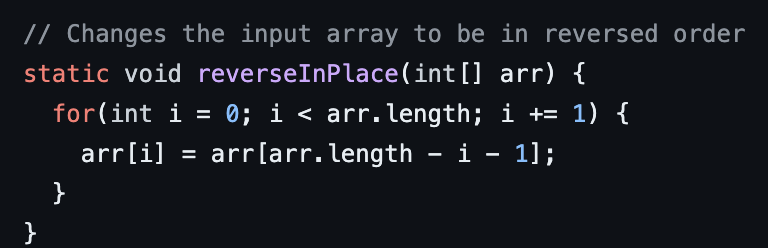
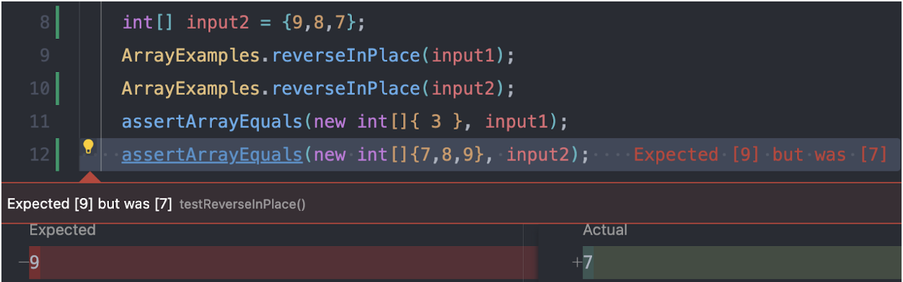

# CSE 15L Lab Report 3

## Part 1 - Bugs

The method I picked out was the bug in ArrayExamples.java, whihc was the *reverseInPlace* method.



A failure inducing output for that method was when I tried to reverse numbers decreasing by one, which was when I tried:

```
int[] input2 = {9,8,7};
assertEquals(new int[] {7,8,9}, input2);
```

An input that doesn't have a failure is when there is on element in the array, such as:

```
int[] input1 = {3};
assertEquals(new int[] {3}, input1);
```

The problem in the method was really just how it accessed and tried to reverse the data, as it seemed to not change the data much at all:



To fix this, I made a temporary array with the same data values, changed the values in there, and then made the original array the same as the temporary array

Before the method looked like this:

```
static void reverseInPlace(int[] arr) {
    for(int i = 0; i < arr.length; i += 1) {
      arr[i] = arr[arr.length - i - 1];
    }
  }
```

Now it looks like this:

```
static void reverseInPlace(int[] arr) {
    int[] temp = new int[arr.length];
    for(int i = 0; i < arr.length; i += 1) {
      temp[i] = arr[i];
    }
    for(int i = 0; i < arr.length; i += 1) {
      arr[i] = temp[temp.length - 1 - i];
    }
  }
```
This fix adresses the issue because the array is now easlily able to get the reversed items into the correct order by copying over from the temp array rather than do it in its own array, which it can't when it is changing the values inide itself already

## Part 2: Researching Commands

The command I chose to research is the *grep* command, which typically takes a string and a file and prints out to the user *all* the lines in that file that match the string. Grep also has some interesting command line arguments to use, such as:

### -r

This command line argument when added to grep looks for the pattern throughout all of the directories (gnu.org).
An example of this can be seen when we try to see the number of lines that have the string "base pair in the technical/plos directory;

```
kaytettey@Kelvins-MacBook-Air docsearch % grep -r "base pair" technical/plos > plos.txt 
kaytettey@Kelvins-MacBook-Air docsearch % wc  plos.txt
       3      48     412 plos.txt
```
With the command, it searches all the files in technical/plos directory for the exact string "base pair". The output shows us that there is only 3 lines with the string "base pair" in the technical/plos directories. This is helpful because with this command, we can find matching files for info we need more quickly.

Another example of this can be seen when the same is tried again, but this time to see in the technical/biomed directory:

```
kaytettey@Kelvins-MacBook-Air docsearch %  grep -r "base pair" technical/biomed > biomed-base-pair.txt
kaytettey@Kelvins-MacBook-Air docsearch % wc biomed-base-pair.txt
     226    2326   22534 biomed-base-pair.txt
```
With the command, it searches all the files in technical/biomed directory for the exact string "base pair". The output shows us that there is 226 lines with the string "base pair" in the technical/biomed directories. Again, this is helpful because with this command, we can find matching files for info we need more quickly.

### -r
